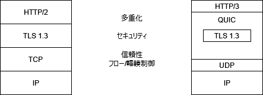

# [QUICをゆっくり解説(1)：QUICが標準化されました](https://eng-blog.iij.ad.jp/archives/10039)

# プロトコル階層

* HTTP/2のプロトコル階層
  * HTTP/2: 多重化されたHTTPの機能
  * TLS 1.3: セキュリティ機能
  * TCP: 信頼性、フロー制御、輻輳制御
* HTTP/3のプロトコル階層
  * HTTP/3: 
  * QUIC: トランスポート層の機能、TLS1.3、HTTP/2に類似する多重化機能
    * TLS 1.3: セキュリティ機能
  * UDP: ポート番号

# 特徴

## 組み込みのセキュリティ

## HoL (Head of Line) ブロッキングの解消

## 0-RTTの利用

## 進化の速度

## ハードウェアの活用

# 普及状況

